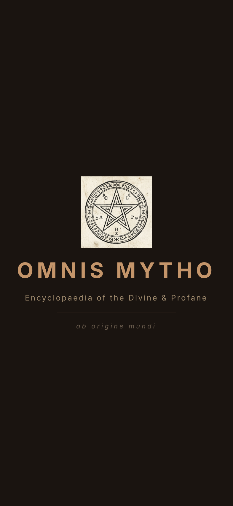
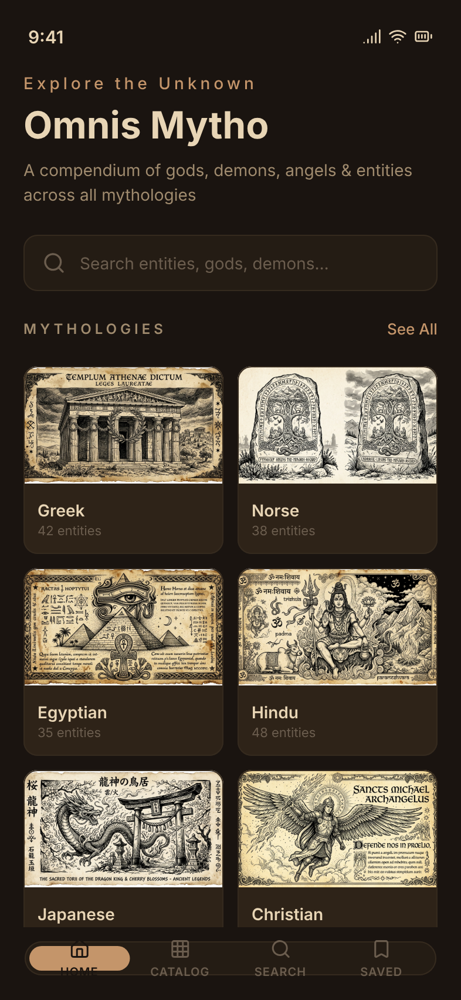
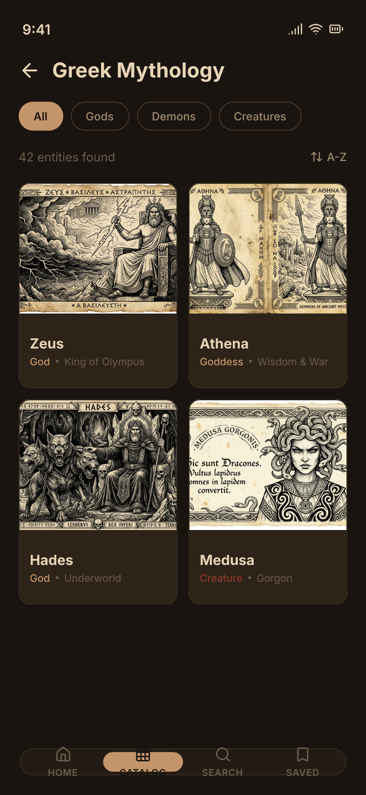
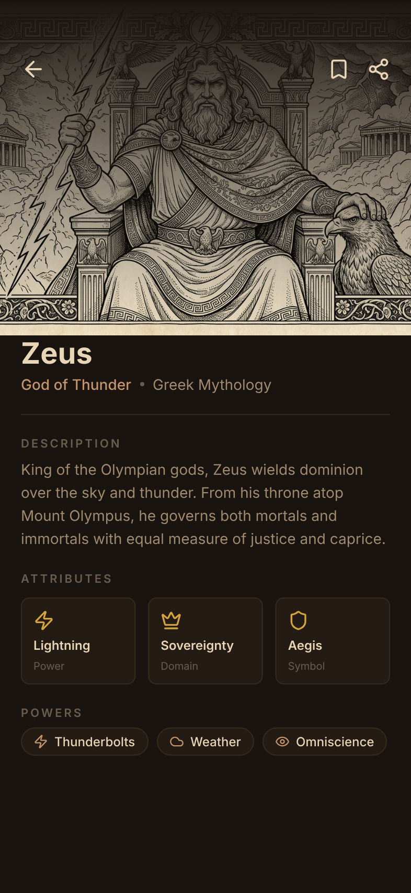
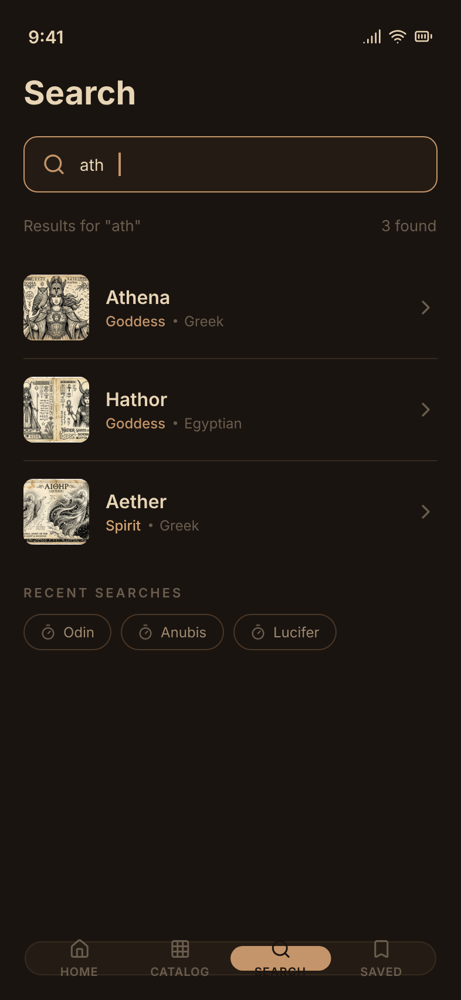

# Omnis Mytho

**Encyclopaedia of the Divine & Profane**

A mythology encyclopedia app showcasing modern Android/KMP development — gods, demons, angels, spirits and creatures from 25 mythological traditions, rendered in the style of an ancient grimoire.

> *ab origine mundi*

---

## Screenshots

<p align="center">
  
  
  
  
  
</p>

<p align="center">
  <sub>Splash · Home · Catalog · Detail · Search</sub>
</p>

---

## Overview

Omnis Mytho is not just an encyclopedia — it's a **technical showcase** of Kotlin Multiplatform, Jetpack Compose, and modern mobile architecture. The mythology content provides a rich, visually striking context to demonstrate:

- **Revolver** MVI state management
- **Koin** dependency injection (multiplatform)
- **Ktor** HTTP networking
- **Coil3** async image loading
- **Navigation 3** with explicit back stack and type-safe NavKey routes
- **Room KMP** offline-first data persistence
- **Atomic Design** component architecture
- **Material3** theming with custom grimoire palette
- **FastAPI** backend with OpenAPI documentation

---

## Mythologies

**25 mythologies, 301 entities** — from Greek gods to Filipino diwata:

| Tradition | Entities | Tradition | Entities |
|-----------|----------|-----------|----------|
| Greek | 23 | Roman | 14 |
| Norse | 14 | Celtic | 14 |
| Egyptian | 16 | Mesopotamian | 14 |
| Hindu | 15 | Chinese | 14 |
| Japanese | 14 | Slavic | 13 |
| Christian | 14 | Aztec | 12 |
| Mayan | 10 | Incan | 9 |
| Polynesian | 9 | Aboriginal | 9 |
| Yoruba | 11 | Vodou | 10 |
| Persian | 12 | Korean | 8 |
| Tibetan | 8 | Finnish | 10 |
| Philippine | 8 | Native American | 10 |
| Indonesian | 10 | | |

---

## Architecture

```
                        +-------------------+
                        |   Compose UI      |
                        |  (Atomic Design)  |
                        +--------+----------+
                                 |
                        +--------v----------+
                        |   Navigation      |
                        |  (Type-safe)      |
                        +--------+----------+
                                 |
                  +--------------v--------------+
                  |     Revolver ViewModels     |
                  |  (Events / States / Effects)|
                  +--------------+--------------+
                                 |
                  +--------------v--------------+
                  |     Domain (Interfaces)     |
                  |  Repository / Models        |
                  +--------------+--------------+
                                 |
                  +--------------v--------------+
                  |     Data (Implementation)   |
                  |  Ktor + DTOs + Mappers      |
                  +--------------+--------------+
                                 |
                  +--------------v--------------+
                  |     FastAPI Backend         |
                  |  /api/v1/* + OpenAPI        |
                  +-----------------------------+
```

### Key Patterns

- **MVI (Model-View-Intent)** via Revolver — unidirectional data flow
- **Repository Pattern** — interfaces in domain, implementations in data
- **DTO/Domain Separation** — API DTOs mapped to clean domain models
- **Navigation via Effects** — ViewModels emit navigation effects, Pages handle routing
- **Offline-first** — Room caches API data, bookmarks persist across restarts
- **Navigation 3** — Explicit back stack with NavDisplay + entryProvider pattern
- **SOLID + DRY** for business logic, **Atomic Design** for UI

---

## Tech Stack

### Mobile App (KMP)
| Technology | Version | Purpose |
|-----------|---------|---------|
| Kotlin | 2.3.20 | Language |
| Compose Multiplatform | 1.10.3 | UI framework |
| Material3 | 1.10.0-alpha05 | Design system |
| Revolver | 1.6.0 | MVI state management |
| Koin | 4.2.0 | Dependency injection |
| Ktor | 3.4.2 | HTTP client |
| Coil3 | 3.4.0 | Image loading |
| Navigation 3 | 1.0.0-alpha05 | NavDisplay + explicit back stack |
| Room KMP | 2.7.1 | Offline-first local database |
| KSP | 2.3.6 | Annotation processing |
| kotlinx.serialization | 1.10.0 | JSON parsing |

### Backend (API)
| Technology | Version | Purpose |
|-----------|---------|---------|
| Python | 3.11+ | Runtime |
| FastAPI | 0.115.6 | REST framework |
| Pydantic | 2.10.4 | Data validation |
| uvicorn | 0.34.0 | ASGI server |

### Image Generation
| Tool | Style |
|------|-------|
| Fal.ai (nano banana) | Black & white ink contour |
| DALL-E 3 (fallback) | Grimoire manuscript |

---

## Project Structure

```
OmnisMytho/
+-- api/                          # FastAPI backend
|   +-- main.py                   # App entry + CORS + routes
|   +-- models/
|   |   +-- mythology.py          # Pydantic models
|   +-- routers/
|   |   +-- mythologies.py        # /mythologies endpoints
|   |   +-- entities.py           # /entities endpoints
|   +-- data/
|   |   +-- seed_data.py          # 30 entities, 6 mythologies
|   |   +-- generate_content.py   # LLM content generation
|   |   +-- generate_images.py    # Image generation (nano banana/DALL-E)
|   +-- static/images/            # Generated images
|   +-- requirements.txt
|
+-- app/                          # KMP mobile app
|   +-- composeApp/
|   |   +-- src/
|   |   |   +-- commonMain/kotlin/com/umain/omnismytho/
|   |   |   |   +-- domain/       # Models + Repository interfaces
|   |   |   |   +-- data/         # DTOs + API service + Repo impls
|   |   |   |   +-- di/           # Koin modules
|   |   |   |   +-- presentation/
|   |   |   |   |   +-- viewmodel/  # Revolver ViewModels
|   |   |   |   |   +-- navigation/ # Routes + NavGraph
|   |   |   |   |   +-- ui/
|   |   |   |   |   |   +-- theme/    # Colors, Type, Shapes, Spacing
|   |   |   |   |   |   +-- atom/     # OmText, OmIcon, OmBadge...
|   |   |   |   |   |   +-- molecule/ # EntityCard, SearchBar...
|   |   |   |   |   |   +-- organism/ # MythologyGrid, FilterBar...
|   |   |   |   |   |   +-- template/ # HomeTemplate, DetailTemplate...
|   |   |   |   |   |   +-- page/     # HomePage, CatalogPage...
|   |   |   |   +-- App.kt
|   |   |   +-- androidMain/      # Android entry point
|   |   |   +-- iosMain/          # iOS entry point
|   |   +-- composeResources/
|   |       +-- font/             # Playfair Display, Lora, Inter
|   +-- iosApp/                   # Xcode project
|   +-- gradle/libs.versions.toml # Version catalog
|
+-- design/
|   +-- OmnisMytho.pen            # Pencil design file (5 screens)
|
+-- README.md
```

---

## Design System

### Color Palette

| Token | Dark | Light | Usage |
|-------|------|-------|-------|
| `bg-primary` | `#1A1410` | `#F5E6CC` | Screen background |
| `bg-surface` | `#241C14` | `#EAD9BD` | Cards, surfaces |
| `bg-card` | `#2E2318` | `#E0CEAE` | Elevated cards |
| `color-primary` | `#C4956A` | `#8B6914` | Primary actions, gold |
| `color-secondary` | `#9B6B4A` | `#6B3A2A` | Secondary, crimson |
| `color-accent` | `#D4A574` | `#A0744C` | Highlights, bronze |
| `text-primary` | `#E8D5B5` | `#2C1810` | Body text |
| `text-secondary` | `#A08B6E` | `#5C4A38` | Subtle text |
| `text-tertiary` | `#6B5D4E` | `#8A7B6A` | Muted text |
| `border-default` | `#4A3728` | `#B8A48C` | Borders |

### Typography

| Scale | Font | Usage |
|-------|------|-------|
| Display / Headline / Title | Playfair Display | Titles, headings |
| Body | Lora | Descriptions, paragraphs |
| Label | Inter | Chips, buttons, metadata |

### Spacing Scale

| Token | Value |
|-------|-------|
| `xs` | 4dp |
| `sm` | 8dp |
| `md` | 16dp |
| `lg` | 24dp |
| `xl` | 32dp |
| `2xl` | 48dp |

### Border Radius

| Token | Value |
|-------|-------|
| `sm` | 8dp |
| `md` | 12dp |
| `lg` | 16dp |
| `xl` | 24dp |

---

## API Documentation

Base URL: `http://localhost:8000`

Swagger UI: `http://localhost:8000/docs`
ReDoc: `http://localhost:8000/redoc`

### Endpoints

#### Mythologies

```
GET /api/v1/mythologies
  Response: Mythology[]

GET /api/v1/mythologies/{mythology_id}
  Response: MythologyDetail (includes entity summaries)
```

#### Entities

```
GET /api/v1/entities
  Query: mythology_id?, type?, alignment?, page=1, page_size=20
  Response: PaginatedResponse { items: Entity[], total, page, page_size, total_pages }

GET /api/v1/entities/{entity_id}
  Response: Entity

GET /api/v1/entities/search
  Query: q (required), limit=10
  Response: Entity[]
```

### Data Models

```
Mythology { id, name, origin, description, entity_count }

Entity {
  id, name, type, title, description, appearance,
  powers[], symbols[], personality, alignment, mythology_id, image_prompt
}

EntityType: god | demon | angel | spirit | creature
Alignment: good | neutral | evil | chaotic
```

---

## Getting Started

### Prerequisites

- Python 3.11+
- Android Studio Ladybug+ (with KMP plugin)
- Xcode 15+ (for iOS)
- JDK 11+

### Run the API

```bash
cd api
python3 -m venv .venv
source .venv/bin/activate
pip install -r requirements.txt
uvicorn main:app --reload --port 8000
```

Visit `http://localhost:8000/docs` for interactive API docs.

### Run the App (Android)

```bash
cd app
./gradlew :composeApp:installDebug
```

Or open `app/` in Android Studio and run the `composeApp` configuration.

### Run the App (iOS)

Open `app/iosApp/iosApp.xcodeproj` in Xcode and run on simulator.

### Run API with ngrok (for device testing)

```bash
cd api
./run_api.sh    # Starts uvicorn + ngrok, writes URL to app/gradle.properties
```

### Generate Content (Optional)

```bash
cd api && source .venv/bin/activate

# Wikipedia scrape only (no API key needed)
python data/scrape_and_generate.py --no-llm --skip-images

# With LLM enrichment (OpenAI primary, Gemini fallback)
export OPENAI_API_KEY=sk-...
export GEMINI_API_KEY=AI...
python data/scrape_and_generate.py --skip-images

# Generate grimoire-style images
export FAL_KEY=...
python data/scrape_and_generate.py --no-llm
```

---

## Screens

| Screen | Description |
|--------|-------------|
| **Splash** | Logo animation with "OMNIS MYTHO" + Latin tagline |
| **Home** | Mythology categories grid (2x3), search bar, bottom nav |
| **Catalog** | Entity grid with filter chips (All/Gods/Demons/Creatures) |
| **Detail** | Immersive hero image, description, attributes, powers |
| **Search** | Live search with results + recent searches |
| **Saved** | Bookmarked entities grid (persisted with Room) |

---

## Image Style

All illustrations follow a consistent grimoire aesthetic:
- **Black and white ink contour** only
- **No fills, no gray tones** — clean linework
- **Aged parchment** texture
- **Medieval manuscript** and alchemical book inspiration
- Generated in two formats: **16:9** (landscape) and **9:16** (portrait)

---

## Roadmap

- [x] Design — 5 screens in Pencil (dark mode, grimoire style)
- [x] API — FastAPI with OpenAPI docs, 301 entities, 25 mythologies
- [x] Content pipeline — Wikipedia scrape + LLM enrichment (OpenAI/Gemini)
- [x] Image generation scripts (nano banana + DALL-E)
- [x] KMP app — Compose + Revolver + Koin + Navigation 3
- [x] Offline-first — Room KMP local cache for entities, mythologies, bookmarks
- [x] Bookmarks — persistent save/unsave with Room, filled icon toggle
- [x] Animations — spring physics, staggered entrances, shimmer loading
- [x] 62+ @Preview annotations (dark mode, 1.5x font, landscape)
- [x] A-Z / Z-A sort toggle in catalog
- [x] Edge-to-edge UI with system bar insets
- [x] Custom app icon and Android 12+ splash screen
- [ ] Paging 3 — infinite scroll in catalog
- [ ] Shared element transitions between catalog and detail
- [ ] Deep links — open entity directly
- [ ] TTS — text-to-speech for descriptions
- [ ] A/B testing — feature flags demo
- [ ] Analytics — event tracking showcase

---

## License

MIT
